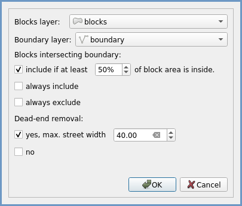
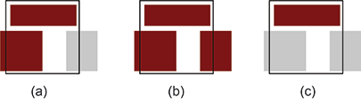

# AwaP 
AwaP is part of AwaP-IC - a QGIS tool that calculates the Area-weighted average Perimeter (AwaP) and Interface Catchment (IC), two measures developed by Pafka & Dovey (2017), that combined, capture the capacities of urban morphologies to enable and attract pedestrian movement. While AwaP and IC should be considered together in the analysis of walkable access, in this 2.0.0 version of the AwaP-IC software the two measures are provided by distinct plugins.

AwaP is a measure of urban permeability, that calculates the average perimeter of urban blocks within a study area, weighing the perimeter of each block by its area. This way the impact of a large block will be proportional with the share of the study area it occupies, and its effect as a major-barrier to movement is not lost in the average. The lower the AwaP, the easier is to walk through the urban fabric. An AwaP of 400m corresponds to a square block of 100x100m, often taken as the maximum block-length that still allows good permeability. 

[IC](https://github.com/Awapic/IC) calculates the total length of public/private interfaces reachable from a starting point and within a given walking distance. IC is relevant for walking as most urban attractions, such as dwellings, shops and workplaces, are accessed through the public/private interface, where buildings meet the street. High IC values indicate high capacity for accommodating urban attractions. Together, these two measures account for both street width and block size, measuring both walkable access and what one gets access to.

## Base requirements
The base requirement for the calculation of these measures is a layer of urban blocks drawn as polygons, or closed polylines. Lines within the blocks, such as lot subdivisions, will be ignored. However other errors in the urban blocks layer may not be recognised by the software, and may lead to errors, or long processing times. As both AwaP and IC are calculated in metres, a projected coordinate system should be used in the QGIS project. Instead of the very common WGS84 - EPSG:4326 which uses degrees as a unit for distance, the projected WGS84/Pseudo-Mercator - EPSG:3857 which measures distances in metres may be used.

# AwaP tool
[Download plugin zip](http://github.com/awapic/awap/raw/master/awap.zip)

It takes in several parameters in order to calculate AwaP:
- *Blocks layer* - A layer containing the urban blocks for which AwaP will be calculated. This layer can have polygon geometries, or linear geometries where outlines of urban blocks are represented as closed polylines.
- *Boundary layer* - A layer containing the boundary of the area of interest (i.e. the area that contains the blocks for which AwaP will be calculated). This layer too can have a polygon geometry, or a linear geometry where the boundary of the area of interest is represented as a closed polyline.
- *Boundary layer options* - Users can choose to calculate a single AwaP for the boundary layer, or if the boundary layer contains multiple polygons, users can choose to calculate separate AwaP value for each polygon in the boundary layer. The button "Create a polygon grid..." opens a QGIS tool where users can easily create a grid for AwaP calculation on multiple polygons in the study area.
- *Blocks intersecting boundary* - A parameter that specifies whether to consider the urban blocks which are only partly within the area of interest. The default option is to include a block if more than half of the block is within the study boundary. See section below for further detail.
- *Dead-end removal* - A parameter that specifies if the dead-end streets should be removed from blocks prior to calculating AwaP, and the maximum width of the dead-end streets to be removed. The default value of 40m should work for most urban morphologies.
- *Apply custom style categories* - If this option is enabled, the layers that are created as a result of AwaP calculation will be rendered according to the user-specified color scheme that can be modified in the plugin window. If disabled, the layers will be rendered in stock red color.

Figure 1: AwaP plugin interface

## Blocks intersecting the boundary
Whether the blocks which are partly inside and partly outside of the area of interest should be considered in this calculation, would depend on the specifics of each research. The tool provides three options:
- *Include if at least some percentage of the block area is inside* - Only the blocks for which more than a specified percentage of their area is inside the area of interest will be included in the AwaP calculation, others will be disregarded (Figure 2a). The default value is 50%.
- *Always include* - All the blocks that are at least partly within the area of interest will be included in the AwaP calculation (Figure 2b).
- *Always exclude* - Only the blocks that are entirely within the area of interest will be included in the AwaP calculation (Figure 2c).

Figure 2: Examples of the urban blocks included in the AwaP calculation (dark red) when using different settings for blocks intersecting the study area boundary (black line).

#### AwaP instructional video:

")

#### Reference:
Majic I. & Pafka E. (2019) [AwaP-IC - An Open-Source GIS Tool for Measuring Walkable Access](https://doi.org/10.3390/urbansci3020048). Urban Science 3(2): 48.

Pafka E & Dovey K. (2017) [Permeability and Interface Catchment: Measuring and Mapping Walkable Access](https://www.researchgate.net/publication/306087166_Permeability_and_interface_catchment_measuring_and_mapping_walkable_access). Journal of Urbanism 10(2): 150-162.

#### Acknowledgement:
The development of this software has been supported by a seed grant provided by the [Transport, Health and Urban Design (THUD)](https://thud.msd.unimelb.edu.au/home) Research Hub of the Melbourne School of Design.
